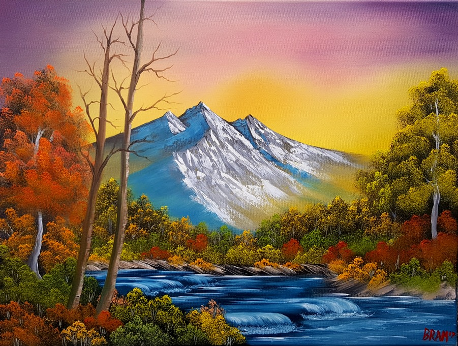
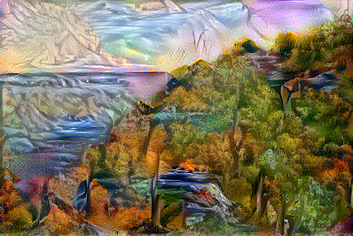

<h1> Neural-Style-Transfer</h1>

<h2>A TensorFlow implementation of a Neural Style Transfer Network</h2>

 

Neural Style Transfer (NST) can be used to copy the style of one image (a Bob Ross painting)
to another image (the content image), while maintaining the overall structure of the image. 
For the original paper describing Neural Style Transfer, see the PDF file located in this repository.

<h3> Turn any landscape photo into a Bob Ross Painting </h3>

##### Content: A picture I took of the Grand Canyon

##### Style: An ordinary Bob Ross Painting
  
The NST will input these two images, and output the picture of the grand canyon, 
but as if it were a Bob Ross Painting: 

##### Style applied to Content

